# The Yelp Dataset - Developing a Recommendation Engine

### Final Project Data 620
> I use the graphs and some of the tools we have learned through social network analysis to discover some relationships in the Yelp Dataset.
I  utilize the Yelp Open dataset (https://www.yelp.com/dataset/), to understand trends in the food industry and users who utilize yelp to provide reviews and feedback. The goal of the analysis is to understand for a major urban area, focusing on the food industry and restuarants in particular: What are the relationships between users who provide reviews and the businesses that they review?  

#### 1. Overview of the Dataset

The dataset consists of a data subset provided for research by Yelp. The dataset consists of various business and user attributes and photos uploaded by businesses and users. For this project I only utilize the businesses and user attributes to the conduct the analysis. The business and user attributes consist of the following key attributes: 

> Information on Businesses:

There is information on businesses, such as the number of reviews, locations, the type of business and other attributes like the type of cusines offered at the restuarant.

> Information on Users:

There is information on users, such as the number of reviews, number of fans, reviewers who are friends.
 
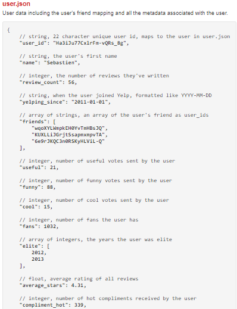

> Information on Reviews:

Actual text of the reviews and the user-id that created the review is also provided, along with rating provided by the reviewer. 

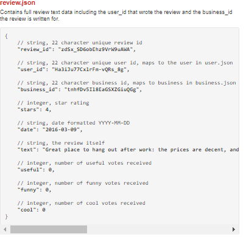

#### 2. Analysis of the data
The analysis below summarizes some of the data cleaning and data munging steps that were taken. I also describe in greater detail descriptions of the data

##### 2.1 Analyzing data from the Businesses
Initial counts of all business indicate that a significant part of the database is located in Arizona. This followed by business in Nevada and then in Ontario Canada
As shown in the table below about 56,600 businesses are located in Arizona. 

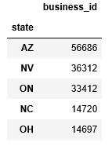

The data is json format. After loading the data, we see that most businesses do not have a very high number of reviews.
However there are some businesses that have a large number of reviews. 

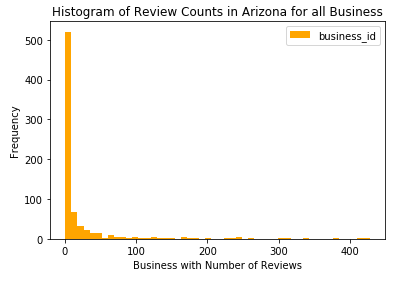

##### 2.2 Business Data Cleaning

Since the data was presented in Json format a number of attributes needed some additional processing. For example a number of 
attributes were sublists and had to be parsed out separately. In particular each business had category classifications and a number of 
attributes that other attributes such as the ambience of the business. After the data cleaning steps the data fields are summarized
below:

 

##### 2.3 Business Data Cleaning

The yelp data contains categories of businesses. Varying degrees of detail are provided and the categories (a total of 8 are retained for further analysis) are not consistent throughout. 
For example, category 1 is typically the more detailed, "Burgers", with category 2, listed as "Restaurants". However, this not always the case and there some cases where category 1 is "Restaurants" while in other cases category 2 is "Restaurants".
Below we check and confirm these:

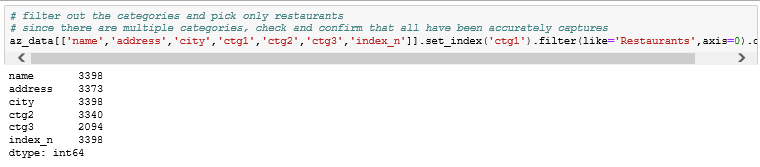 

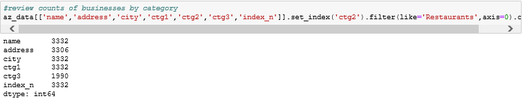 

The final list of restaurants is determined by filtering on the eight categories referenced above, as shown in the code below:

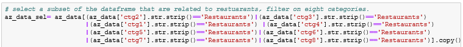 

As a result of the filtering, out of the aproximately **56,600** businesses in Arizona, only approximately **11,300** are restaurants or food businesses.

##### 2.4 Understanding the Restaurant Data

I conduct some initial analysis on the restaurants. Star rating reviews for the restaurants are shown in the charts below. Two charts are shown, in the left
all restaurant ratings are shown, while in the chart on the right showns only those restaurants that have 20 or more reviews. The main goal is to filter out restaurants that have a number of reviews
which may bias the results.  

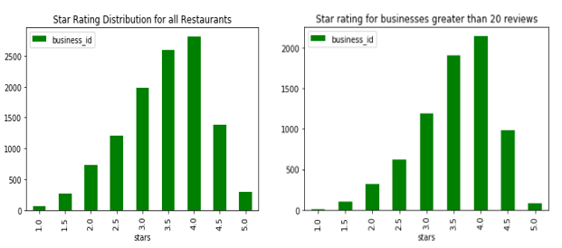 

As a results of the additional filter of considering only those restaurants that have 20 or more reviews consist of **7,364** restaurants out of the starting approximately **11,300** restaurants or food businesses. 

I conduct a further categorization of the number of reviews for each business. 

- Medium: Between 250 and 500 reviews
- High: Between 500 and 1000 reviews
- Very High: Greater than 1000 reviews
- Low: Otherwise

As can be seen that the "very high" review category, which generally consist of the most popular restaurants has mostly postive reviews, with a star rating of 4 or more.
  

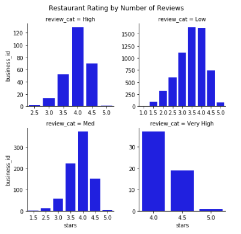 

Finally, the number of review counts for each star rating of a restaurant is shown in the chart below. There is a steep decline in the number of business with a high number of reviews.

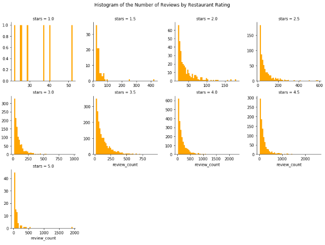 

##### 2.6 Incorporating User Reviews
User reviews for each restaurant, including some information on the user and the text of the review is provided by Yelp. After some data munging we get the first few observations in the dataset as shown below:

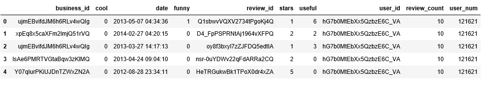 

The figure below shows the distribution of the reviews by users. As can be seen from the charts most users have relatively few reviews, however, there are some who are very prolific reviewers. 

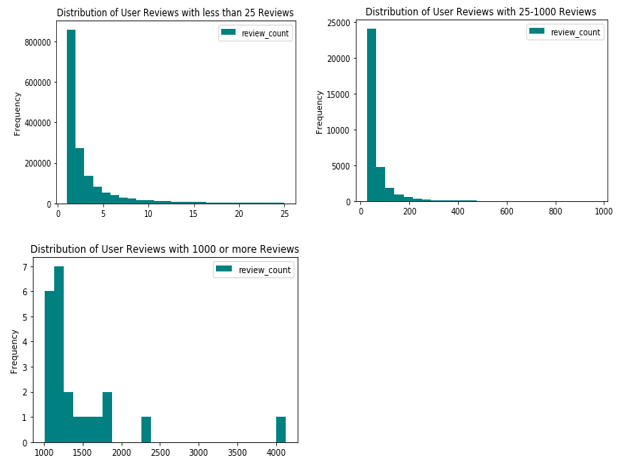 

#### 3. Setting up the Recommendation Engine 

##### 3.1 Conduct the Recommendation Predictions
We conduct 3 different algorithm predictions using the surprise package. SVD- with 5 latent factors, estimated over 25 epochs. 
Two algorithms for K-Nearest Neighbors (baseline and mean) for a maximal neighbor prediction of 20, with similiarities calculated
using cosine similarity.  

##### 3.2 Evaluating Performance

We evaluate the performance of the three algorithms we used, SVD, KNN Baseline and KNN with Means. Overall the SVD seems to perform better
based on the testing conducted. 

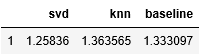  

##### 3.3 Nearest Neighbor Prediction
Using the nearest neighbor algorithms we predict which restaurants are most similar. One of the most popular restaurants is **Pizzeria Bianco**. 
The algorithms suggest that **Celsius Sushi Bar** and **PotBelly Sandwich shop** are most similar. 

##### 3.4 Categorizing Regional Cusines
In addition to understanding the relationships between reviewers and the food industry businesses, I developed categories cusineses by region. It would be interesting 
to see what the relationship between the different types of restaurants and reviewers is. In order to do that I had to develop a standard category. As can be seen 
in the data snap shot below the yelp restaurant data categories are not standard. 

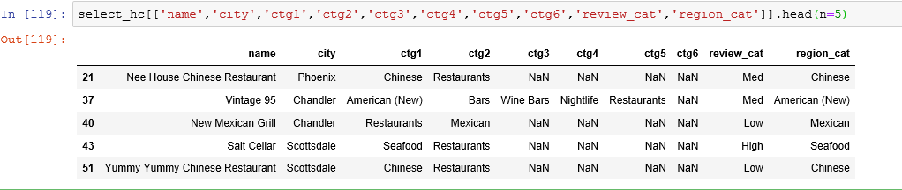 

I did this through identifying first all the categories represented in the data, and concatecated to a simple list, as shown below:

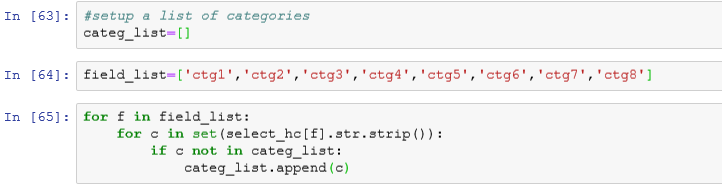 

Then through a visual inspection of the categories, specific list of regions was identified as can be seen below

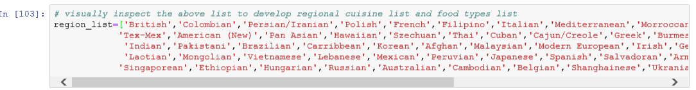 

Most of the businesses were assigned to a category, although not all fit neatly into a regional cuisine category. Counts of the final top 7 categories are shown below:

 

#### 4. Next Steps

The are a number of steps that can be taken here that can further improve the analysis further including: 
- Incorporate restaurant food category along with other metrics such as geographic location into the consideration
- Incorporate a novelty factor 
- Topical analysis of the textual reviews; For example developing topic models to understand the different topics covered by reviews and the review ratings
- Incorporating labelled image data into recommendation algorithms along with potential topic models to develop better recommendations

