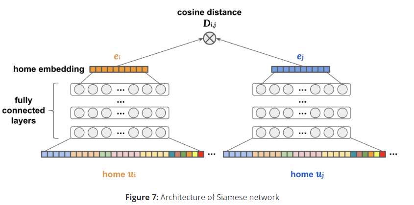
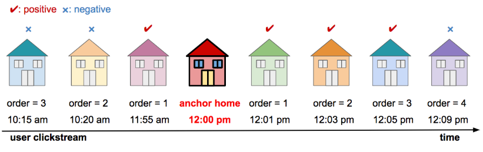
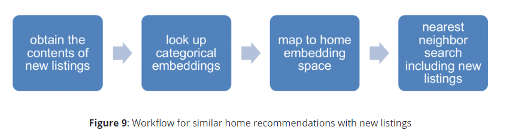
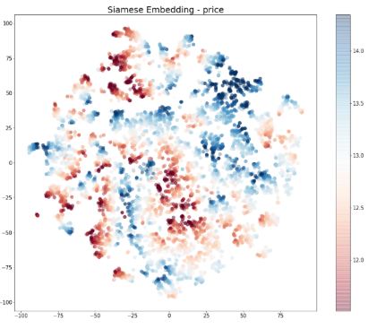

# Research Assignment 1

*Now that we have covered basic techniques for recommender systems, choose one commercial recommender and describe how you think it works (content-based, collaborative filtering, etc). 
Does the technique deliver a good experience or are the recommendations off-target?*

*You may also choose one of the three non-personalized recommenders (below) we went over in class and describe the technique and which of the three you prefer to use.*

1. Metacritic:  How We Create the Metascore Magic
2. Rotten Tomatoes: About Rotten Tomatoes
3. IMDB: FAQ for IMDb Ratings

Thousands of users including buyers and renters use Zillow everyday to buy homes and explore homes for purchase or rent. Zillow also offers additional services like buying homes from prospective sellers and 
guaranteeing them a purchase price while the home-owner looks for another home. 

As many users have discovered while on their site that Zillow provides recommendations on "similar homes for sale". The analysis and commentary here is based on an excellent article shared by data scientists' at Zillow on the process they used to develop 
the recommendation engine (see link below to read article in detail). I briefly describe the process they use and some of the challenges that are unique to Zillow that this approach addresses. (*Note: all analysis and intellectual content belongs to authors of the article, I have merely summarized it, figures are sourced from the article as well*)
Finally I provide my assessment as a user for the relevance of the recommendations. 
 
#### Unique Challenges
Zillow faces some unique challenges that may or may not be faced by other technology firms, 

1. Large proportion of unregistered or new users: like for example a number of users may be browsing or checking out listing and not have a user account or a profile
history that can be leveraged. For example Airbnb and others use collaborative filtering to determine - recommendations based on user profiles
2. Large number of categorical variables: For example zip codes, zoning type, school district, city region or neighborhood, and house type
3. Greatly differing meaning for characteristics: Access to outdoor space or nearness to parks has a much higher value in New York City or San Francisco than in other parts of country
4. Wide variety of structure and unstructured data: Zillow has a wide variety of data it can utilize, which include, numerical structured data like price, categorical data like zip codes and finally, images and image attributes, and text descriptions
For text descriptions note that everyone is looking to sell, so simple positive or negative sentiment rankings are not going to work. While the authors do not cover this in detail in general I feel that text data coming from 
seller descriptions would not be very useful. 

#### Methodology Overview
The main goal of the approach is to develop a deep learning model using data from Zillow. The performance of the model is evaluated using
click data from users. Given that the approach uses a deep learning model all the categorical data needs to be converted to numerical values. 

In this approach the first step the author's use is to convert the categorical determine similarity between the categories like zip-codes. They author's could use a dummy variable approach (or one-hot encoding approach) where each category
would be treated as a binary indicator. They use a skip-gram model to convert the zip codes
to a numerical representation. The skip-gram model uses an approach to identify similar zip-codes based on the users clicks. The large number of categorical variabes are treated in this 
way to make the handling more efficient and to convert them into the numerical respresentations. 

For numerical values different transformations are considered such as log transforms, standardizing amongst other approaches.

The second step is to develop a deep learning network model. The deep learning model is based on a "siamese  twin" approach. The architecture of the network is shown
below. The approach takes input data on the listings and converts them to a "home embedding" features space. This is a reduced feature space that is an output of the neural network. 
The output of the neural network is a vector using which co-sine similarity can calculated:

 
The homes attributes' are input features based on the above clicking behavior observed during an illustrative window. The estimating windows assume 
for example 10 minute duration, with a window size of 3. Thus homes that are clicked by the user are considered similar while homes that not clicked during the window are assumed to be not similar.   

The overall process can be summarized as below for new listings. 

Get the content of new listings, lookup categorical embeddings, map to home space and finally use a nearest neighbors approach to fit / predict cosine similarity 

While I understand the basic idea presented here, there are a few questions that I need to dig further into:
1) What algorithms are being used to generate recommendations for model training? Aren't the models being used for generating recommendations in turn 
determining the efficacy of this model? 
2) Unsure about how the nearest neighbor approach is used to calculate or predict cosine-similarity

#### Assessment

Another interesting thing I learned during this review was t-SNE (t-Distributed Stochastic Neighbor Embedding). The technique uses PCA type (though technical details are different)
dimension reduction approach. The dimension reduction approach can be used to further understand how high dimensional data is similar to one another. Below the author's show a t-SNE 2-D plot
with price highlighted in different colors. As can be seen the t-SNE algorithm applied on the "home embeddings" output, shows how the different price points are clustered. 

*You should post the GitHub link to your research in a new discussion thread.*

## Attacks on Recommender System

*Read the article below and consider how to handle attacks on recommender systems. Can you think of a similar example where a collective effort to alter the workings of content recommendations have been successful? How would you design a system to prevent this kind of abuse?*
*Travis M. Andrews, The Washington Post (2017): Wisdom of the crowd? IMDb users gang up on Christian Bale’s new movie before it even opens.*

While I am not aware of specifically of a misuse of say a Zillow type of recommender system, but it is not inconceivable to think about
a bots that may be used to influence the results of the recommender system. For example, an advertiser may pay or create bots to ensure that its
properties may be ranked higher than other in search results. In this case though, it may be a lot easier and hassle to just pay Zillow to promote its property!

#### References
1. *Home Embeddings for Similar Home Recommendations* [https://www.zillow.com/tech/embedding-similar-home-recommendation/]