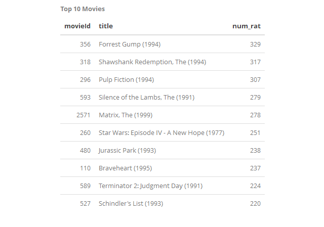
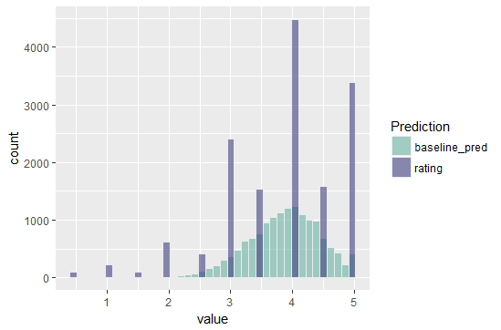
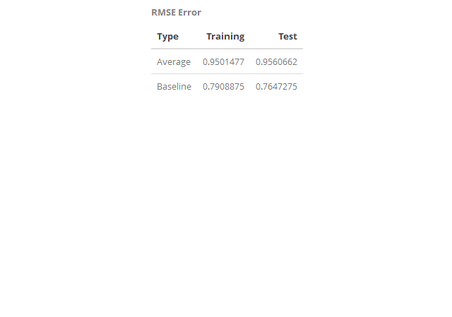

## Data 612 - Global Baseline Predictors and RMSE

This dataset (ml-latest-small) describes 5-star rating and free-text tagging activity from MovieLens, a movie recommendation service. It contains 100,836 ratings and 3,683 tag applications across 9742 movies. These data were created by 610 users between March 29, 1996 and September 24, 2018. This dataset was generated on September 26, 2018.

Users were selected at random for inclusion. All selected users had rated at least 20 movies. No demographic information is included. Each user is represented by an id, and no other information is provided.

The data are contained in the files links.csv, movies.csv, ratings.csv and tags.csv. 

## Project 1
> In this first assignment, we’ll attempt to predict ratings with very little information. We’ll first look at just raw averages across all (training dataset) users. We’ll then account for “bias” by normalizing across users and across items.

This dataset and this analysis could ultimately be used to develop a movie recommendation engine. In order to develop a movie recommendation we need some benchmarks and ways to measure and predict future ratings. The goal of this assignment is to develop simple benchmarks that can be used to compare model performance. 

As a first step I used and downloaded the above dataset. See R code in the folder. 

The data was generally clean. In order to make the analysis more tractable, I select only the movies that have 100 or more user ratings. The top 10 of this list is shown below. The list contains some famous movies that we are all fans of! There are a total of 136 movies that have a hundred or more user-ratings. 

We conduct a number of summary analysis on this dataset. In particular, we develop a baseline predictor and compare it to the simple average prediction. RMSE's are calculated on the training and test dataset for comparison. Key steps of the analysis include

#### 1. Select a subsample of the dataset
#### 2. Develop baseline predictor by accounting for bias across users and across movies
#### 3. Develop Training and Test sets (training=75%, test=25%)
#### 4. Conduct Baseline prediction and average prediction
#### 5. Calculate RMSE across different prediction

The histogram below shows a comparison of the ratings from users relative the baseline predictor.  

After the calculation of the baseline predictor which incorporates biases from users and specific movies and includes (adds) these biases to the average prediction. As expected RMSE for both test and training set decline by over 30%. In both cases, test and training set performance was quite similar as the prediction approaches were very general and had no opportunities for overfitting. 

### References
1. F. Maxwell Harper and Joseph A. Konstan. 2015. The MovieLens Datasets: History and Context. ACM Transactions on Interactive Intelligent Systems (TiiS) 5, 4: 19:1–19:19. 
https://doi.org/10.1145/2827872
2. https://stackoverflow.com/questions/3053833/using-r-to-download-zipped-data-file-extract-and-import-data
3. https://stackoverflow.com/questions/56951752/kable-caption-in-rmarkdown-file-in-html-in-bold
4. http://haozhu233.github.io/kableExtra/awesome_table_in_html.html#overview
