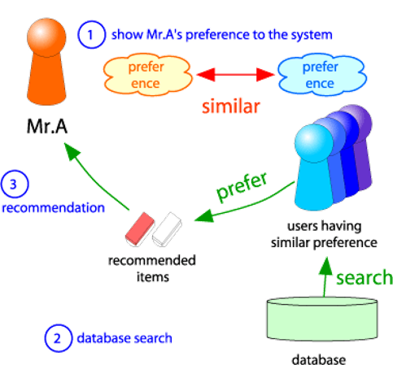
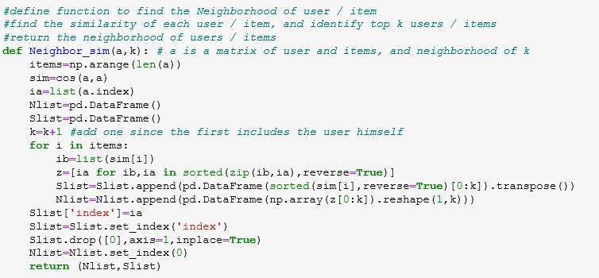
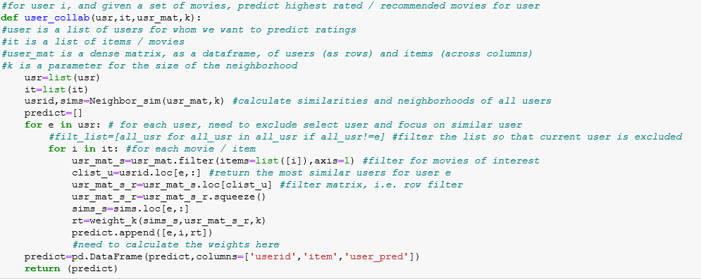
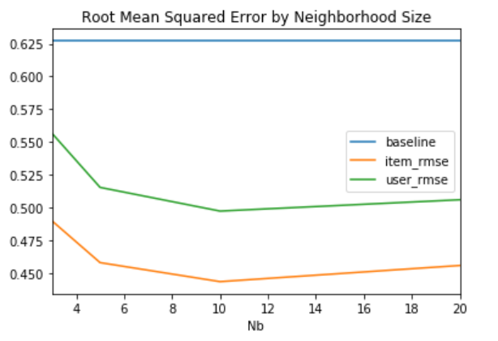
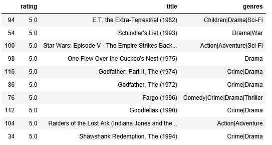
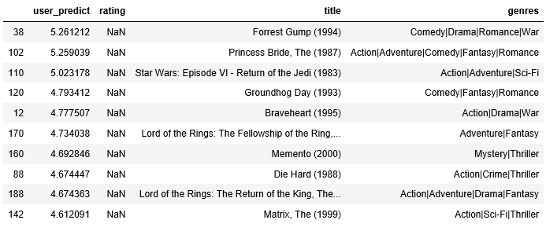
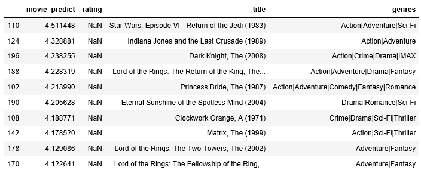

## Developing Collaborative Filtering Based Recommmendation Engines

## Project 2
> In this assignment, we are asked to develop at least two recommendation algorithms from the list below:
- Content Filtering
- User-User based Collaborative Filtering
- Item-Item based Collaborative Filtering

For this analysis we use User-User and Item - Item based Collaborative Filtering

#### 1. Collaborative Filtering - A very brief Primer

Collaborative filtering seeks to develop a recommendation engine based on the ratings that other users have provided for a product or item. 

The figure below illustrates this idea further. A particular user is recommended similar items based on what other users have rated highly. 

The key consideration is that we want incorporate the fact the some users and / or  some products are more similar than others. Those that are more similar should be given a stronger consideration in our rating prediction / or recommendations.
   
Key challenges of this method is how to measure and incorporate this similarity. 
- Item-Item : These consider similaritities at the product or item level. The user is recommended similar items as he as preferred in the past
- User-User : These consider similaritities at the user level. The user is recommended items that similar users have preferred

#### 2. The Dataset

This dataset (ml-latest-small) describes 5-star rating and free-text tagging activity from MovieLens, a movie recommendation service. It contains 100,836 ratings and 3,683 tag applications across 9742 movies. These data were created by 610 users between March 29, 1996 and September 24, 2018. This dataset was generated on September 26, 2018.

Users were selected at random for inclusion. All selected users had rated at least 20 movies. No demographic information is included. Each user is represented by an id, and no other information is provided.

The data are contained in the files links.csv, movies.csv, ratings.csv and tags.csv. 

To limit the time and scale of the analysis we sub-selected the 100 movies (i.e. movies that were rated by most users) and 100 users (i.e. users who had rated the most movies)

#### 3. Code User-User and Item - Item based Collaborative Filtering
Snippets of the code used to develop the analysis is shown below. Similarity of users is determined using cosine similarity. Cosine similarity is calculated after standardizing
ratings at the user or item level based on the approach that is being utilized. 
- In the first step we determine the "Neighborhood" of a user. The neighborhood consists of the "N" most similar (determined by cosine similarity) users. 

- In the second step we use neighborhood of a user, to actually calculate the rating for the new item. The weighting function "weight_k" calculates the actual rating using a weighted average of the cosine similarities.
 

#### 4. Develop baseline predictor 

To compare the performance of the recommendation system we calculate a baseline predictor by accounting for bias across users and across movies

#### 5. Calculate RMSE across different approaches

For the sub-sample described above, we evaluate the different approaches and calculate the RMSE across each including the baseline predictor. 
We compare the performance by different neighorhood sizes. Based on the data sample and the Neigbhorhood sizes considered it seems that **N=10** is optimal.    
Finally, we note that RMSE across Item-Item filtering is much lower than User-User filtering

#### 6. Qualitatively evaluating the recommendations

While the RMSE calculation is instructive it does not give us a sense of how good the recommendations are from an intuitive perspective. As a result we select two users.
**User 290** is a user that has the least number of movie ratings (in the top - 100 of movie raters). **User 270** is a user that has the top 5 number of ratings in the 
(in the top-100 of movie raters). The table below shows the top-10 movie ratings of User 290. It is clear the user likes sci-fi movies, action and adventure movies.  

Do the recommendations make sense? Lets evaluate these below: 

**User Based Collaborative Filtering**

**Item Based Collaborative Filtering**

In many respects that movie recommendations are similar for both Item and User based but there are important differences. For example Star Wars and Lord of the Rings feature in both recommendations, while 
but there are some notable differences. For example in the User based recommendation "Forest Gump" is rated most highly where as in the Item based recommendation "Star Wars: Return of the Jedi"
is rated most highly. 

While both give reasonable and quite good recommendations it seems, the item based movie recommendation does seem to do better. 

#### 7. Next Steps

The are a number of steps that can be taken here that can further improve the recommendations generated, and this analysis is quite simple in its approach. 
- Incorporate additional information into the similarlity calculation. Here we only use the ratings, however, we can use / consider information on movie geners and some of the tags that these movie raters have developed
- Consider additional metrics for the ratings similarity calculation including the use of the baseline predictor

### References
1. F. Maxwell Harper and Joseph A. Konstan. 2015. The MovieLens Datasets: History and Context. ACM Transactions on Interactive Intelligent Systems (TiiS) 5, 4: 19:1–19:19. 
https://doi.org/10.1145/2827872
2. J. Leskovec, A. Rajaraman, J. Ullman: Mining of Massive Datasets, http://www.mmds.org

