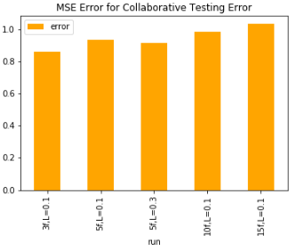
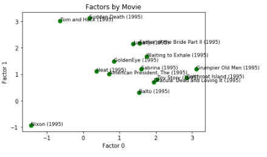
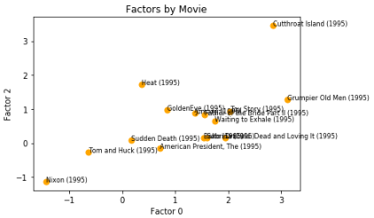

## Developing Collaborative Filtering Using Singular Value Decomposition and Alternating Least Squares

## Project 3
> In this assignment, we are asked to implement or use Singular value decomposition or alternating least squares:

#### 1. Alternating Least Squares 

Alternating least squares can be used to estimate the solution to the optimization problem where the missing ratings are 
estimated using an approach where, factors related to users are fixed while a least squares solution is estimated for the movies/items. 
On the other hand, the items are fixed, while a least squares solution is estimated for the factors related to users. For the implementation
of the ALS solution I used an implementation developed and referenced below.  

The results shown below and discussed below are using the movie lens dataset. For the analysis I split the dataset 70% into
training and the remaining 30% into the test set. 

I tested different numbers of factors to implement the analysis. The results, in terms of errors on the training data,
are shown for 3 factors and 15 factors. 

As can be seen the error on the training set is much lower on the training set with 15 factors than compared to 3 factors. 
The figure below shows the different solutions that were run. These include 3 factors, and lambda (the regularization parameter)
at 0.1, followed by 5 factors with lambda at 0.1, and 5 factors with lambda at 0.3, 10 factors with lambda at 0.1 and 15 factors with lambda at 0.1.
Note that, the model does perform the best on the training set, with 15 factors. 

Finally, the analysis shows the test error for the different runs conducted. The model with 15 factors performs the worst, indicating over fitting issues. On the other
hand the model with 5 factors, especially the one with a higher lambda of 0.3 performs slightly. Clearly overfitting is an issue and further testing should be conducting with 
higher weights on lambda to improve model testing error. 

Using the 3 factor model then, I investigated visually, how does the model classifies the different movies. The charts below 
show how different movies are classified by the 3 factors. The expectation is would be that movies that similar should be 
closely clustered, where as those that less similar should be less clustered.  

The results are reasonable, particularly in the second plot the a number of the movies that are similar are closely clustered
while this result is less clear for the first plot. 

Finally, I use the results to generate similar movies for the analysis - using the 3 factor model. I use co-sine similarity on the factors,
to determine movies that are most similar to each other. I show movies that are most similar to "Father of the Bride II". The resuls are reasonable
though could certainly be better with further tuning and analysis. 
 

### References
1. F. Maxwell Harper and Joseph A. Konstan. 2015. The MovieLens Datasets: History and Context. ACM Transactions on Interactive Intelligent Systems (TiiS) 5, 4: 19:1–19:19. 
https://doi.org/10.1145/2827872
2. J. Leskovec, A. Rajaraman, J. Ullman: Mining of Massive Datasets, http://www.mmds.org
3. Implementation of ALS Factorization - https://github.com/mickeykedia/Matrix-Factorization-ALS/blob/master/ALS%20Python%20Implementation.py)

